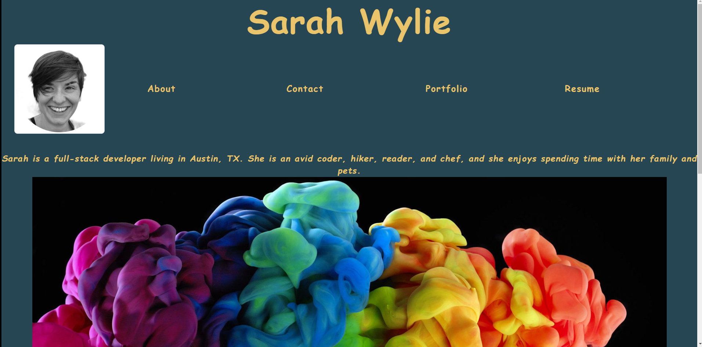

# Hello Wylie!

## Description
Learn more about me, visit my portfolio to see a sample of my work, and download my resumé. Then hire me!

## Table of Contents
* [Usage](#usage)
* [Installation](#installation)
* [Tests](#tests)
* [Badges](#badges)
* [Queries](#any-questions)

## Usage
I'm hardworking and fun. Get to know me! Find out how I can help your company, be an asset on your team, or just help out with your next gig.

## Installation
Visit [my website](https://sarahwylie.github.io/hello-wylie/about) to get started!

## Output:

 
## Tests
This project was tested using Jest.

### Badges

### Any Questions?
Contact [@sarahwylie](https://github.com/sarahwylie) on GitHub

© 2022 by Sarah Wylie
